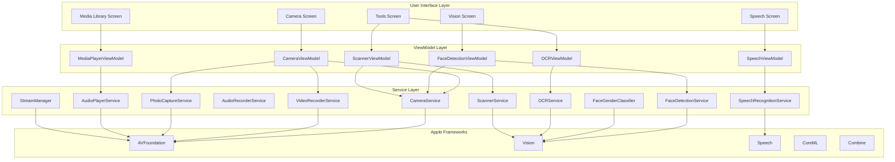
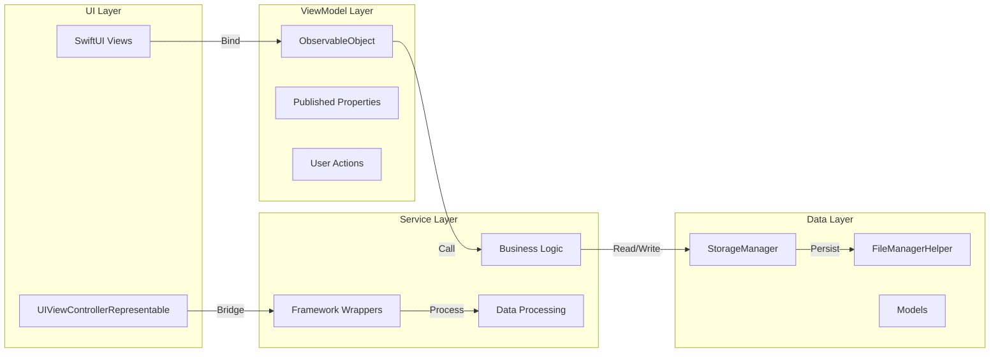
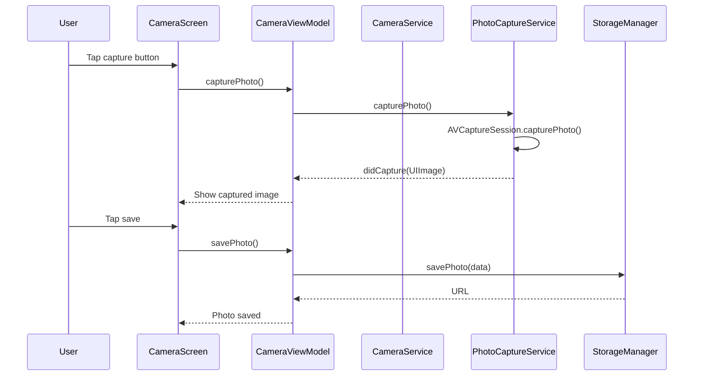
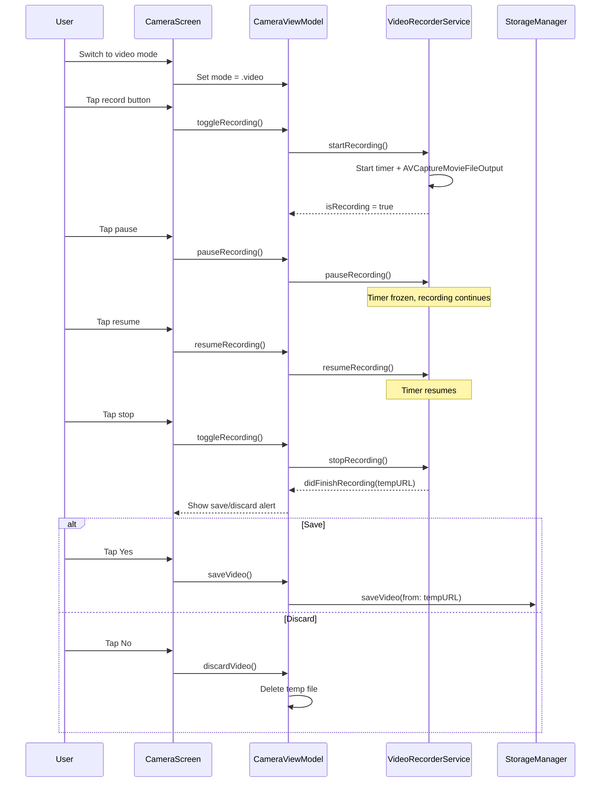
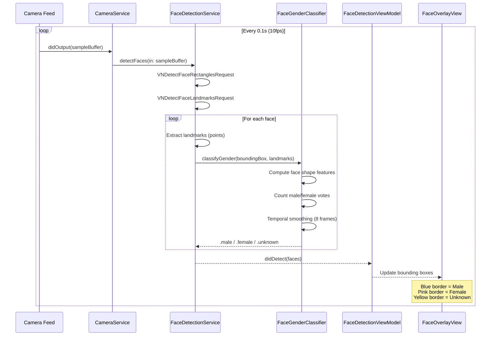
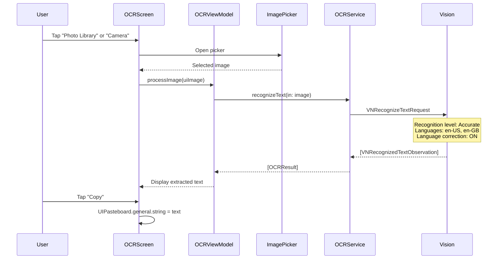
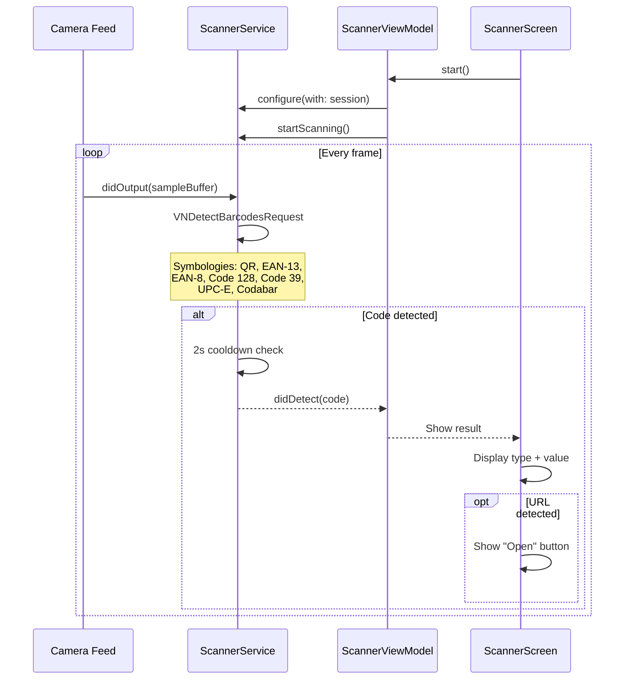
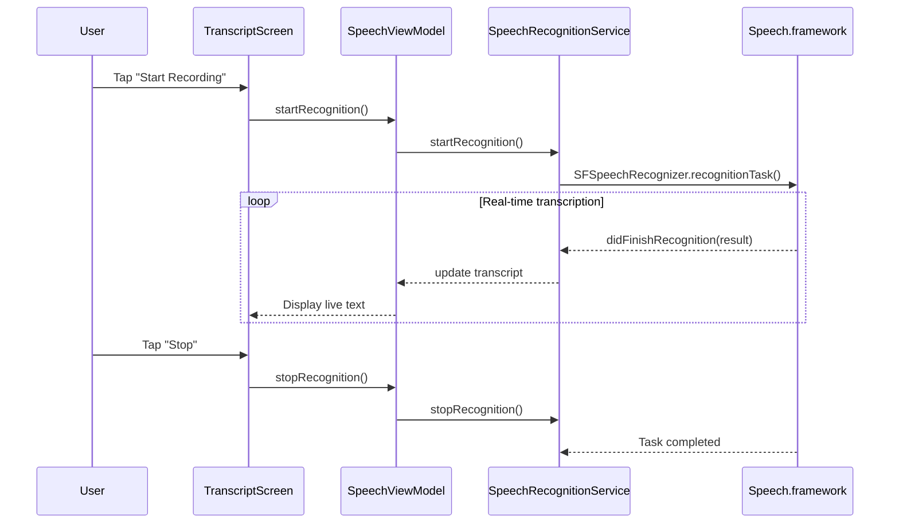
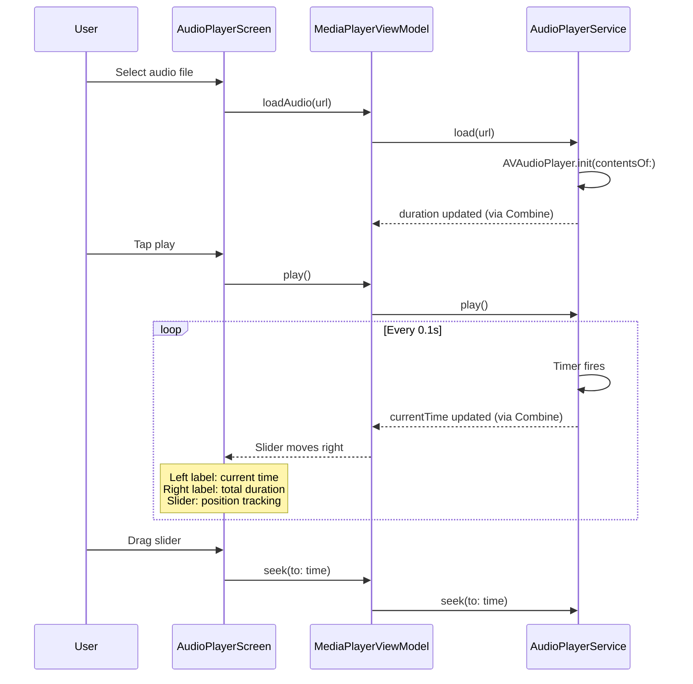
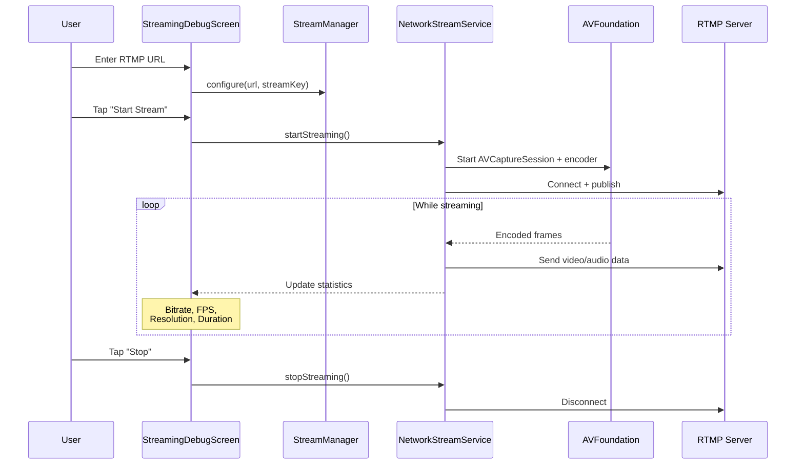

# CreatorStudioPro

**A unified media engine for camera, audio, speech, vision, editing, and streaming — built entirely in Swift.**

CreatorStudioPro is a production-grade iOS application that consolidates every major media workflow into a single, modular codebase. From real-time face detection with gender classification to live RTMP streaming, from OCR text extraction to barcode scanning — it's a complete toolkit for content creators, developers, and media professionals.

---

## Table of Contents

- [Features](#features)
- [Screenshots](#screenshots)
- [Real-World Problems Solved](#real-world-problems-solved)
- [Target Users](#target-users)
- [Initial Setup](#initial-setup)
- [Architecture](#architecture)
- [Feature Workflows](#feature-workflows)
- [Project Structure](#project-structure)
- [Technical Decisions](#technical-decisions)
- [License](#license)

---

## Features

| Tab | Feature | Description |
|-----|---------|-------------|
| **Camera** | Photo Capture | High-resolution photo capture with flash, zoom, focus |
| | Video Recording | Record with pause/resume, save/discard prompt, max duration |
| | Gallery | Browse captured photos, tap to view full-screen |
| **Media** | Media Library | Grid view of all photos, videos, and audio files |
| | Video Playback | Full player with seek bar, skip forward/backward |
| | Audio Playback | Audio player with progress tracking and controls |
| | Delete Media | Long-press any item to delete with confirmation |
| **Speech** | Transcription | Real-time speech-to-text using Apple Speech framework |
| | Text-to-Speech | Synthesize text into natural-sounding audio |
| **Vision** | Face Detection | Detect faces with bounding boxes and confidence scores |
| | Gender Classification | Heuristic-based male/female detection using face landmarks |
| | Camera Switch | Toggle front/back camera during face detection |
| **Tools** | Voice Recorder | Record audio with level visualization |
| | Audio Analysis | Analyze audio files for waveform and frequency data |
| | Text-to-Speech Playground | Experiment with TTS voices and settings |
| | OCR | Extract text from images using Vision framework |
| | QR & Barcode Scanner | Scan QR codes, EAN-13, EAN-8, Code 128, UPC-E |
| | Streaming Debug | Configure and test RTMP/HLS streaming |

---

## Real-World Problems Solved

### 1. Fragmented Media Tools
**Problem:** Creators juggle 5-10 separate apps for camera, recording, editing, transcription, and streaming.

**Solution:** CreatorStudioPro unifies all media workflows into one app. Record audio, capture video, transcribe speech, detect faces, scan barcodes — all without leaving the app.

### 2. Content Creation & Moderation
**Problem:** Platforms need to moderate user-generated content for appropriate face detection, age estimation, and text extraction.

**Solution:** Real-time face detection with gender classification, plus OCR for extracting text from screenshots and documents. Useful for content review pipelines.

### 3. Accessibility Barriers
**Problem:** Visually impaired users struggle with text in images and physical products.

**Solution:** OCR extracts text from any image. Barcode/QR scanner identifies products and opens URLs. Text-to-Speech reads content aloud.

### 4. Live Streaming Complexity
**Problem:** Setting up a live stream requires understanding RTMP URLs, stream keys, encoding settings, and network configuration.

**Solution:** Built-in streaming debug tool with dynamic URL/host/port configuration, real-time statistics, and network status monitoring.

### 5. Media Asset Management
**Problem:** Scattered photos, videos, and recordings across multiple apps with no unified library.

**Solution:** Centralized media library with grid browsing, preview, playback, and delete functionality across all media types.

### 6. Speech-to-Text for Documentation
**Problem:** Manual transcription of meetings, interviews, and lectures is time-consuming.

**Solution:** Real-time speech recognition with live transcript display, plus export capabilities for documentation workflows.

---

## Target Users

| User Domain | How They Benefit |
|-------------|-----------------|
| **Content Creators** | All-in-one tool for recording, editing, and streaming content |
| **iOS Developers** | Reference implementation for AVFoundation, Vision, and Speech frameworks |
| **Media Professionals** | Quick audio/video capture with professional controls |
| **Educators & Students** | Speech transcription for lectures, OCR for textbook scanning |
| **Accessibility Users** | Text-to-speech, barcode scanning, and OCR for visual assistance |
| **Quality Assurance Teams** | Face detection for UI testing, barcode scanning for inventory |
| **Journalists** | Quick recording, transcription, and document scanning in the field |
| **Retail & Inventory** | Barcode/QR scanning for product identification and tracking |

---

## Initial Setup

### Prerequisites

| Requirement | Version |
|-------------|---------|
| macOS | 15.0+ (Sequoia) |
| Xcode | 26.0+ |
| iOS Deployment Target | 26.0 |
| Swift | 6.0 |

### Steps

```bash
# 1. Clone the repository
git clone https://github.com/your-org/CreatorStudioApp.git
cd CreatorStudioApp

# 2. Open the project
open CreatorStudioApp.xcodeproj

# 3. Select a simulator or device
# iPhone 16 Pro recommended for full feature testing

# 4. Build and run (Cmd + R)
```

### First Launch

1. **Camera Permission** — Required for photo/video capture, face detection, and barcode scanning
2. **Microphone Permission** — Required for audio recording and speech recognition
3. **Speech Recognition Permission** — Required for real-time transcription
4. **Photo Library Permission** — Required for saving and loading media

> All permissions are requested on-demand when you first use a feature. The Settings screen shows permission status badges.

### No External Dependencies

CreatorStudioPro uses **zero third-party libraries**. Every feature is built with native Apple frameworks:

| Framework | Used For |
|-----------|----------|
| AVFoundation | Camera, audio recording, video playback |
| Vision | Face detection, gender classification, OCR, barcode scanning |
| Speech | Real-time speech recognition |
| AVSpeechSynthesizer | Text-to-speech |
| CoreML | Gender classification model support |
| Combine | Reactive data flow between services and views |
| SwiftUI | All user interface |
| UIKit | Camera preview, video player (via UIViewControllerRepresentable) |

---

## Architecture

### High-Level Architecture



### Layer Responsibilities



---

## Feature Workflows

### Camera Photo Capture



### Video Recording with Pause/Resume



### Face Detection with Gender Classification



### OCR Text Extraction



### QR & Barcode Scanner



### Speech Recognition



### Audio Playback with Seek



### Live Streaming



---

## Project Structure

```
CreatorStudioApp/
├── App/
│   ├── CreatorStudioApp.swift      # App entry point
│   └── AppRouter.swift             # Navigation, tabs, destinations
│
├── Core/
│   ├── Constants/
│   │   ├── AppConstants.swift      # App-wide constants
│   │   ├── PermissionKeys.swift    # Permission key strings
│   │   └── FileNames.swift         # File naming conventions
│   ├── Extensions/
│   │   ├── URL+Extensions.swift
│   │   ├── View+Extensions.swift
│   │   ├── Color+Extensions.swift
│   │   ├── AVCaptureDevice+Extensions.swift
│   │   └── CMSampleBuffer+Extensions.swift
│   ├── Helpers/
│   │   ├── FileManagerHelper.swift # Directory management
│   │   ├── VideoHelper.swift
│   │   ├── AudioHelper.swift
│   │   ├── Logger.swift            # Unified logging
│   │   └── TimeFormatter.swift     # Time display formatting
│   ├── Managers/
│   │   ├── AppStateManager.swift
│   │   ├── NetworkMonitor.swift
│   │   ├── StorageManager.swift    # Photo/video/audio persistence
│   │   └── PermissionCoordinator.swift
│   └── Permissions/
│       ├── CameraPermissionManager.swift
│       ├── MicrophonePermissionManager.swift
│       └── SpeechPermissionManager.swift
│
├── Models/
│   ├── Shared/
│   │   └── MediaType.swift
│   ├── Vision/
│   │   └── FaceModel.swift         # Face + landmarks + gender
│   ├── Audio/
│   │   └── AudioRecordingModel.swift
│   └── ...
│
├── Services/
│   ├── Camera/
│   │   ├── CameraService.swift     # AVCaptureSession management
│   │   ├── PhotoCaptureService.swift
│   │   ├── VideoRecorderService.swift # Pause/resume, save/discard
│   │   └── MultiCamService.swift
│   ├── Audio/
│   │   ├── AudioSessionService.swift
│   │   ├── AudioRecorderService.swift
│   │   ├── AudioPlayerService.swift
│   │   ├── AudioEngineService.swift
│   │   └── AudioAnalyzer.swift
│   ├── Speech/
│   │   ├── SpeechRecognitionService.swift
│   │   └── TextToSpeechService.swift
│   ├── Vision/
│   │   ├── FaceDetectionService.swift   # VNDetectFaceLandmarksRequest
│   │   ├── FaceGenderClassifier.swift   # Heuristic gender classification
│   │   ├── FaceTrackingService.swift    # VNTrackObjectRequest
│   │   ├── OCRService.swift            # VNRecognizeTextRequest
│   │   └── ScannerService.swift        # VNDetectBarcodesRequest
│   ├── Playback/
│   │   └── VideoPlayerService.swift
│   ├── Editing/
│   │   ├── VideoCompositionService.swift
│   │   └── ExportService.swift
│   └── Streaming/
│       ├── StreamEncoder.swift
│       ├── StreamManager.swift
│       └── NetworkStreamService.swift
│
├── UIKitBridge/
│   └── Camera/
│       ├── CameraViewController.swift  # AVCaptureVideoPreviewLayer
│       ├── CameraPreview.swift         # UIViewControllerRepresentable
│       ├── PlayerViewController.swift
│       └── ...
│
├── Features/
│   ├── Camera/
│   │   ├── Screens/
│   │   │   ├── CameraScreen.swift
│   │   │   ├── GalleryScreen.swift
│   │   │   └── PhotoViewerScreen.swift
│   │   ├── ViewModels/
│   │   │   └── CameraViewModel.swift
│   │   └── Components/
│   │       ├── CameraControlsView.swift
│   │       ├── CaptureButton.swift
│   │       ├── CameraToolbar.swift
│   │       └── RecordingTimerView.swift
│   ├── Media/
│   │   └── MediaLibraryScreen.swift
│   ├── Playback/
│   │   ├── Screens/
│   │   │   ├── AudioPlayerScreen.swift
│   │   │   ├── VideoPlayerScreen.swift
│   │   │   └── MediaLibraryScreen.swift
│   │   ├── ViewModels/
│   │   │   └── MediaPlayerViewModel.swift
│   │   └── Components/
│   │       ├── SeekBarView.swift
│   │       └── PlaybackControls.swift
│   ├── Speech/
│   │   ├── Screens/
│   │   │   ├── TranscriptScreen.swift
│   │   │   └── TTSPlaygroundScreen.swift
│   │   └── ViewModels/
│   │       └── SpeechViewModel.swift
│   ├── Vision/
│   │   ├── Screens/
│   │   │   ├── FaceDetectionScreen.swift
│   │   │   ├── FaceTrackingScreen.swift
│   │   │   ├── OCRScreen.swift
│   │   │   └── ScannerScreen.swift
│   │   ├── ViewModels/
│   │   │   ├── FaceDetectionViewModel.swift
│   │   │   └── FaceTrackingViewModel.swift
│   │   └── Components/
│   │       ├── FaceOverlayView.swift
│   │       └── FaceBoundingBox.swift
│   ├── Tools/
│   │   ├── VoiceMemoScreen.swift
│   │   ├── AudioAnalysisScreen.swift
│   │   ├── StreamingDebugScreen.swift
│   │   └── ...
│   ├── Common/
│   │   └── SplashScreen.swift
│   └── VideoRecording/
│       ├── Screens/
│       │   └── VideoRecorderScreen.swift
│       ├── ViewModels/
│       │   └── VideoRecorderViewModel.swift
│       └── Components/
│           └── RecordingTimerView.swift
│
├── Resources/
│   ├── Assets.xcassets/
│   │   ├── AccentColor.colorset/
│   │   └── LaunchScreenBackground.colorset/
│   └── Info.plist
│
└── Tests/
    └── CreatorStudioAppTests/
```

---

## Technical Decisions

| Decision | Rationale |
|----------|-----------|
| **UIKit + SwiftUI Bridge** | Camera preview requires `AVCaptureVideoPreviewLayer` (UIKit); all other UI is SwiftUI for modern declarative syntax |
| **Per-Instance Camera Caching** | Static cache caused second `CameraService` instance to skip config; now each instance caches independently |
| **Async Camera Configuration** | `configureSession()` is async/await, called after permission grant, not in `init()` |
| **Heuristic Gender Classification** | No Core ML model bundled; uses face landmark geometry (jaw ratio, nose width, lip fullness, brow shape) with 8-frame temporal smoothing |
| **Video Recording: Save/Discard** | Recording doesn't auto-save; delegates temp URL to caller who decides via alert — prevents accidental storage fills |
| **Zero Dependencies** | All features use native Apple frameworks only — no CocoaPods, SPM, or Carthage |
| **Combine Over Closures** | Service-to-ViewModel communication uses `@Published` + `assign(to:)` for type-safe, leak-resistant bindings |
| **Coordinator Pattern** | `AppCoordinator` manages tab navigation and deep linking via `AppRouter.Destination` enum |

---

## License

This project is proprietary software. All rights reserved.

---

**Built with ❤️ using AVFoundation, Vision, Speech, and SwiftUI**
